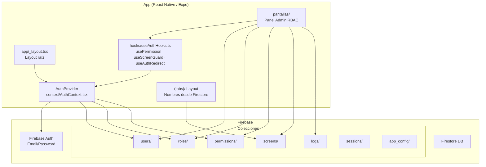
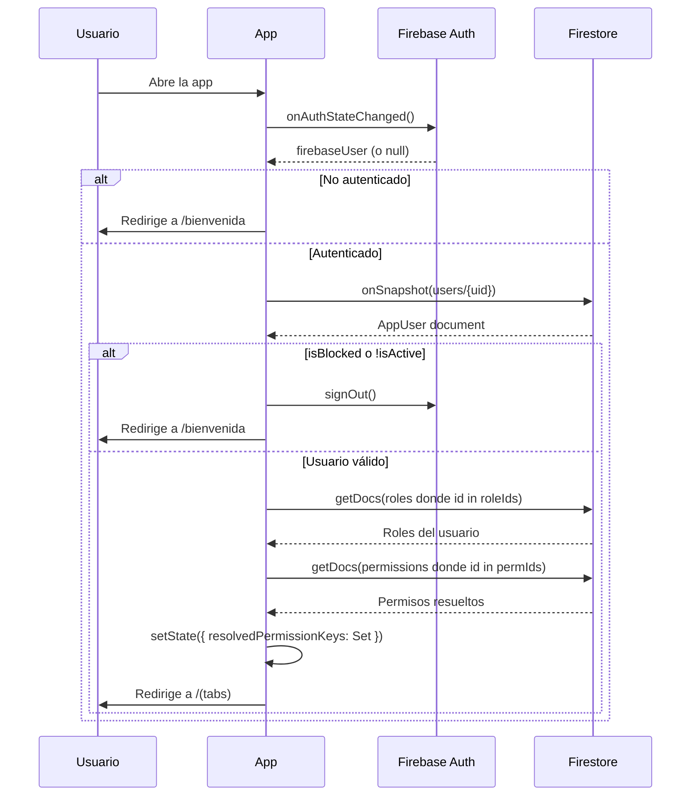
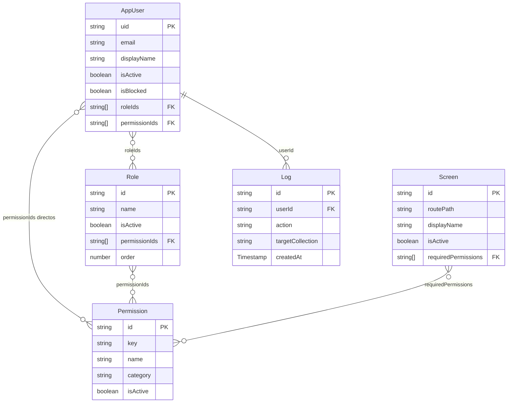

# Documentación completa — Permisos App (h_app)

> React Native · Expo SDK 54 · Firebase · TypeScript · RBAC
> **Autor:** Jorge Alejandro Martinez Vazquez

---

## Índice

1. [Visión general](#1-visión-general)
2. [Setup y README](#2-setup-y-readme)
3. [Arquitectura del sistema](#3-arquitectura-del-sistema)
4. [Firebase — Documentación técnica](#4-firebase--documentación-técnica)
5. [Variables de entorno](#5-variables-de-entorno)
6. [Sistema RBAC](#6-sistema-rbac)
7. [Componentes, Hooks y Tipos](#7-componentes-hooks-y-tipos)
8. [Pantallas](#8-pantallas)

---

## 1. Visión general

> App móvil React Native / Expo con sistema de roles y permisos (RBAC) en tiempo real sobre Firebase.

### ¿Qué hace esta app?

**Permisos App** es una aplicación móvil que permite controlar **quién puede ver qué** dentro de la app, sin necesidad de publicar una nueva versión. Todo se administra en tiempo real desde un panel de control:

- Un administrador puede **bloquear un usuario** y ese usuario es desconectado en segundos
- Puedes **activar o desactivar pantallas** completas para grupos de usuarios
- Puedes **renombrar pantallas** y el cambio se refleja al instante para todos
- Los **permisos se definen una vez** y se reutilizan en cualquier pantalla o componente

**Ejemplo práctico:**
```
Administrador entra al panel → asigna el rol "Gerente" a un usuario
→ ese usuario ahora puede ver la pantalla de Reportes
→ sin reiniciar la app, sin nueva versión, en tiempo real
```

### Stack tecnológico

| Tecnología | Versión | Para qué se usa |
|---|---|---|
| **Expo** | SDK 54 | Framework base — builds, assets, plugins nativos |
| **React Native** | 0.81 | UI multiplataforma (iOS, Android, Web) |
| **Expo Router** | v6 | Navegación basada en archivos (file-based routing) |
| **TypeScript** | 5.9 | Tipado estático en todo el proyecto |
| **Firebase Auth** | v12 | Autenticación de usuarios |
| **Firestore** | v12 | Base de datos en tiempo real — roles, permisos, logs |
| **Firebase Admin SDK** | v13 | Script de inicialización (solo servidor/Node.js) |
| **React** | 19 | Librería de UI |

### Arquitectura en 30 segundos

```
┌─────────────────────────────────────────────┐
│              App (React Native)              │
│                                             │
│  AuthContext ──▶ Firebase Auth              │
│       │               │                     │
│       ▼               ▼                     │
│  Firestore ◀──── users / roles / perms      │
│       │                                     │
│  resolvedPermissionKeys (Set en memoria)    │
│       │                                     │
│  usePermission() / useScreenGuard()         │
│       │                                     │
│  Pantallas visibles según rol del usuario   │
└─────────────────────────────────────────────┘
```

El modelo RBAC funciona así:

```
Permission  →  key única (ej: "manage:users")
    ↑
Role        →  array de permissionIds
    ↑
AppUser     →  roleIds[] + permissionIds[] directos
               Permisos finales = union de ambos
```

### Colecciones en Firestore

| Colección | Descripción |
|---|---|
| `users` | Usuarios con sus roles y permisos asignados |
| `roles` | Roles disponibles (Administrador, Gerente, etc.) |
| `permissions` | Permisos atómicos con una key única |
| `screens` | Configuración de pantallas — activas/inactivas, permisos requeridos |
| `logs` | Auditoría inmutable de todas las acciones |
| `sessions` | Registro de sesiones activas e históricas |
| `app_config` | Configuración global de la app |

### Roles creados por defecto

| Rol | Acceso |
|---|---|
| `System Master` | Acceso total — gestiona colecciones base |
| `Administrador` | Gestión completa de usuarios y pantallas |
| `Gerente` | Lectura de usuarios, roles y logs |
| `Visualizador` | Solo lectura básica |

### Pantallas principales

| Pantalla | Ruta | Permiso requerido |
|---|---|---|
| Home / Tabs | `(tabs)/` | Solo estar autenticado |
| Gestión de usuarios | `pantallas/usuarios` | `manage:users` |
| Gestión de roles | `pantallas/roles` | `manage:roles` |
| Gestión de pantallas | `pantallas/pantallas` | `manage:screens` |
| Logs de auditoría | `pantallas/logs` | `read:logs` |
| Panel System Master | `pantallas/system-master` | `system:master` |

### Seguridad

Las reglas de Firestore (`firestore.rules`) son la última línea de defensa. Ningún cliente puede saltarlas aunque modifique el código de la app.

**Reglas clave:**
- Los usuarios solo pueden editar su propio documento, pero **nunca** pueden cambiar sus propios roles, permisos, o estado de bloqueo
- Los logs son **inmutables** — no se pueden editar ni borrar desde el cliente
- Solo `system:master` puede crear nuevos permisos o modificar `app_config`

### Archivos clave del proyecto

| Archivo | Propósito |
|---|---|
| `lib/firebase.ts` | Inicialización de Firebase con variables de entorno |
| `lib/types.ts` | Todos los tipos TypeScript del proyecto |
| `context/AuthContext.tsx` | Estado global de autenticación + resolución de permisos en tiempo real |
| `hooks/useAuthHooks.ts` | `usePermission`, `useScreenGuard`, `useAuthRedirect` |
| `seed.js` | Script de inicialización de Firestore (se corre una sola vez) |
| `firestore.rules` | Reglas de seguridad de Firestore |

### Setup inicial (resumen)

```bash
# 1. Instalar dependencias
npm install

# 2. Crear .env con credenciales de Firebase
# (ver sección Variables de entorno)

# 3. Inicializar datos en Firestore (una sola vez)
GOOGLE_APPLICATION_CREDENTIALS=./service-account.json node seed.js

# 4. Correr la app
npx expo start
```

### Recursos y referencias

#### Documentación oficial

- **[Expo Docs](https://docs.expo.dev/)** — documentación completa del SDK, plugins, EAS Build
- **[Expo Router](https://docs.expo.dev/router/introduction/)** — enrutamiento basado en archivos
- **[React Native Docs](https://reactnative.dev/docs/getting-started)**
- **[Firebase Docs — Firestore](https://firebase.google.com/docs/firestore)**
- **[Firebase Docs — Auth](https://firebase.google.com/docs/auth)**
- **[Firebase Docs — Security Rules](https://firebase.google.com/docs/rules)**
- **[TypeScript Handbook](https://www.typescriptlang.org/docs/handbook/intro.html)**

#### Videos tutoriales

- **[Firebase React Native Expo Authentication Setup](https://www.youtube.com/watch?v=0_mRcoypaKk)** *(2024)*
- **[React Native Firebase Authentication with Expo Router — Galaxies.dev](https://www.youtube.com/watch?v=BsOik6ycGqk)** *(2024)*
- **[File Based Routing | Expo Router Tutorial](https://www.youtube.com/watch?v=4qVLgaRHPaw)** *(2025)*
- **[Complete Expo Router Bottom Tabs Tutorial](https://www.youtube.com/watch?v=dCsdWVs1iv0)** *(2025)*
- **[React Native Tutorial: Firebase Firestore CRUD](https://www.youtube.com/watch?v=wTgUxYOehZ4)** *(2024)*

---

## 2. Setup y README

### Requisitos

- Node.js 18+
- Expo CLI (`npm install -g expo-cli`)
- Cuenta Firebase con proyecto activo
- Archivo `.env` con variables de Firebase

### Scripts disponibles

```bash
npm run start          # Inicia el servidor de desarrollo
npm run android        # Abre en emulador Android
npm run ios            # Abre en simulador iOS
npm run web            # Abre en navegador
npm run lint           # Corre ESLint
npm run reset-project  # Limpia el proyecto
```

### Estructura de carpetas

```
h_app/
├── app/                          # Pantallas (file-based routing con Expo Router)
│   ├── _layout.tsx               # Layout raíz — envuelve con AuthProvider
│   ├── (tabs)/
│   │   └── _layout.tsx           # Tabs principales (nombres desde Firestore)
│   ├── bienvenida/               # Pantallas públicas (sin auth)
│   ├── login/                    # Pantallas de login
│   └── pantallas/                # Panel de administración RBAC
│       ├── usuarios.tsx
│       ├── roles.tsx
│       ├── pantallas.tsx
│       ├── logs.tsx
│       └── system-master.tsx
├── lib/
│   ├── firebase.ts               # Inicialización y exports de Firebase
│   └── types.ts                  # Todos los tipos TypeScript del proyecto
├── context/
│   └── AuthContext.tsx           # Proveedor de autenticación + permisos resueltos
├── hooks/
│   └── useAuthHooks.ts           # usePermission, useScreenGuard, useAuthRedirect
├── services/
│   ├── authService.ts
│   ├── userService.ts
│   ├── screenService.ts
│   └── logService.ts
├── assets/
├── docs/
├── seed.js
├── firestore.rules
├── app.json
├── package.json
└── tsconfig.json
```

### Asignar primer administrador

Después de correr el seed, asigna el rol de administrador a tu usuario desde Firebase Console:

1. Ir a **Firestore → colección `users` → tu UID**
2. Editar el documento y agregar:

```json
{
  "roleIds": ["role_admin"],
  "isActive": true,
  "isBlocked": false
}
```

Para acceso total (System Master):

```json
{
  "roleIds": ["role_system_master"]
}
```

> ⚠️ **Nunca subas `service-account.json` a git** — agrégalo a `.gitignore`
> ⚠️ **Nunca subas `.env`** con tus credenciales Firebase

---

## 3. Arquitectura del sistema

### Visión general

**Permisos App** es una aplicación Expo/React Native con autenticación y control de acceso por roles (RBAC) gestionado enteramente desde Firebase. No tiene backend propio — toda la lógica de negocio corre en el cliente con Firestore como fuente de verdad.

### Diagrama de arquitectura



### Diagrama de flujo de autenticación



### Diagrama del modelo de datos RBAC



### Estructura de navegación (Expo Router)

```
app/
├── _layout.tsx              ← Stack raíz + AuthProvider + useAuthRedirect
├── bienvenida/
│   └── bienvenida.tsx       ← Pantalla de bienvenida (pública)
├── login/
│   └── login.tsx            ← Formulario de login (pública)
├── (tabs)/
│   ├── _layout.tsx          ← Bottom tabs — nombres y orden desde Firestore
│   └── index.tsx            ← Tab principal (home)
└── pantallas/               ← Panel de administración (requiere permisos)
    ├── usuarios.tsx         ← manage:users
    ├── roles.tsx            ← manage:roles
    ├── pantallas.tsx        ← manage:screens
    ├── logs.tsx             ← read:logs
    └── system-master.tsx    ← system:master
```

### Decisiones técnicas

**Por qué Firestore con `onSnapshot` en vez de REST polling**
Los permisos y el estado de bloqueo de usuarios cambian en tiempo real desde el panel de administración. Con `onSnapshot`, el cliente recibe los cambios inmediatamente sin necesidad de reiniciar sesión ni hacer polling. Si un admin bloquea a un usuario, ese usuario es desconectado en segundos.

**Por qué los permisos se resuelven en memoria (no se persisten en Firestore)**
Persistir `resolvedPermissionKeys` en el documento del usuario crearía un problema de consistencia: si se agrega un permiso a un rol, habría que actualizar todos los usuarios con ese rol. En cambio, resolverlos en memoria al cargar la sesión garantiza que siempre estén actualizados con el estado real de roles y permisos.

**Por qué TypeScript strict mode**
El proyecto usa `"strict": true` en `tsconfig.json`. Esto evita errores comunes con `null`/`undefined` en los datos de Firestore, que pueden ser `null` si los documentos no existen o tienen campos opcionales.

**Por qué `chunkArray` en lugar de una sola query**
Firestore limita las consultas `where('__name__', 'in', [...])` a **10 elementos** por query. La función `chunkArray` divide los arrays de IDs en grupos de 10 y hace múltiples queries en paralelo.

**Sobre `service-account.json`**
El archivo `service-account.json` en el repo es para uso local del script `seed.js` durante el setup inicial. **Debe estar en `.gitignore`** y nunca subirse a ningún repositorio o entorno de CI/CD.

---

## 4. Firebase — Documentación técnica

Proyecto Firebase: **des-app-movil**

### Servicios utilizados

| Servicio | Uso |
|---|---|
| Firebase Auth | Autenticación de usuarios (email/password) |
| Firestore | Base de datos principal — usuarios, roles, permisos, logs |
| Firebase Admin SDK | Script de seed (`seed.js`) — solo en servidor |

### Inicialización (`lib/firebase.ts`)

```ts
import { getApps, initializeApp } from "firebase/app";
import { getAuth } from "firebase/auth";
import { getFirestore } from "firebase/firestore";

const app = getApps().length === 0 ? initializeApp(firebaseConfig) : getApps()[0];

export const auth = getAuth(app);
export const db = getFirestore(app);
```

El patrón `getApps().length === 0` evita inicializar Firebase múltiples veces en hot reload de Expo.

### Colecciones Firestore

#### `users/{uid}`

| Campo | Tipo | Descripción |
|---|---|---|
| `email` | `string` | Email del usuario |
| `displayName` | `string` | Nombre para mostrar |
| `photoURL` | `string \| null` | URL de foto de perfil |
| `isActive` | `boolean` | Si el usuario puede acceder a la app |
| `isBlocked` | `boolean` | Bloqueo manual por un administrador |
| `roleIds` | `string[]` | IDs de roles asignados |
| `permissionIds` | `string[]` | Permisos adicionales directos (fuera de roles) |
| `lastLogin` | `Timestamp \| null` | Último inicio de sesión |
| `createdAt` | `Timestamp` | Fecha de creación |
| `updatedAt` | `Timestamp` | Última modificación |
| `updatedBy` | `string` | UID del usuario que modificó |

**Reglas de acceso:** Lectura por el propio usuario o quien tenga `manage:users` / `system:master`. Borrado deshabilitado.

#### `roles/{roleId}`

| Campo | Tipo | Descripción |
|---|---|---|
| `name` | `string` | Nombre del rol |
| `description` | `string` | Descripción del rol |
| `permissionIds` | `string[]` | IDs de permisos que otorga este rol |
| `order` | `number` | Orden de visualización (`-1` para System Master) |
| `isActive` | `boolean` | Si el rol está habilitado |

**Roles creados por el seed:**

| ID | Nombre | Descripción |
|---|---|---|
| `role_system_master` | System Master | Acceso total, gestiona colecciones base |
| `role_admin` | Administrador | Gestión completa de usuarios y pantallas |
| `role_gerente` | Gerente | Lectura de usuarios, roles y logs |
| `role_visualizador` | Visualizador | Solo lectura básica |

#### `permissions/{permId}`

| Campo | Tipo | Descripción |
|---|---|---|
| `key` | `string` | Identificador único (ej: `"manage:users"`) |
| `name` | `string` | Nombre legible |
| `description` | `string` | Qué permite hacer |
| `category` | `string` | Categoría (ej: `"users"`, `"screens"`, `"system"`) |
| `isActive` | `boolean` | Si el permiso está habilitado |

**Permisos creados por el seed:**

| Key | Descripción |
|---|---|
| `read:users` | Ver lista de usuarios |
| `manage:users` | Crear, editar y bloquear usuarios |
| `read:roles` | Ver roles y permisos |
| `manage:roles` | Crear y editar roles |
| `manage:screens` | Activar/desactivar/renombrar pantallas |
| `read:logs` | Ver logs de auditoría |
| `manage:config` | Modificar configuración de la app |
| `system:master` | Acceso total (solo para `role_system_master`) |

#### `screens/{screenId}`

| Campo | Tipo | Descripción |
|---|---|---|
| `routePath` | `string` | Ruta Expo Router (ej: `"(tabs)/index"`) |
| `displayName` | `string` | Nombre visible, editable desde admin |
| `isActive` | `boolean` | Si la pantalla está habilitada |
| `requiredPermissions` | `string[]` | Permission keys requeridas (lógica AND) |
| `icon` | `string \| null` | Nombre de ícono |
| `order` | `number` | Orden en navegación |
| `parentScreenId` | `string \| null` | Para pantallas anidadas |

#### `logs/{logId}`

Auditoría inmutable de todas las acciones relevantes del sistema.

| Campo | Tipo | Descripción |
|---|---|---|
| `userId` | `string` | UID del actor |
| `userEmail` | `string` | Email del actor |
| `action` | `LogAction` | Tipo de acción |
| `targetCollection` | `string` | Colección afectada |
| `targetId` | `string` | Documento afectado |
| `oldValue` | `object \| null` | Valor antes del cambio |
| `newValue` | `object \| null` | Valor después del cambio |
| `createdAt` | `Timestamp` | Momento de la acción |

**Actualización/Borrado: deshabilitado (inmutable)**

**Acciones posibles (`LogAction`):**
`login` | `logout` | `create` | `update` | `delete` | `read` | `block_user` | `unblock_user` | `assign_role` | `remove_role` | `assign_permission` | `remove_permission` | `enable_screen` | `disable_screen` | `change_screen_name`

#### `sessions/{sessionId}`

| Campo | Tipo | Descripción |
|---|---|---|
| `userId` | `string` | UID del usuario |
| `loginAt` | `Timestamp` | Inicio de sesión |
| `logoutAt` | `Timestamp \| null` | Cierre de sesión (null si activa) |
| `platform` | `string` | Plataforma |
| `appVersion` | `string` | Versión de la app |
| `isActive` | `boolean` | Si la sesión está activa |

#### `app_config/{key}`

| Campo | Tipo | Descripción |
|---|---|---|
| `value` | `unknown` | Valor de la configuración |
| `description` | `string` | Qué controla esta config |
| `isPublic` | `boolean` | Si es accesible sin permisos especiales |

**Creación/Actualización: solo `system:master`. Borrado: deshabilitado.**

### Script de seed (`seed.js`)

```bash
# Requiere service-account.json descargado de Firebase Console
GOOGLE_APPLICATION_CREDENTIALS=./service-account.json node seed.js
```

Crea: 8 permissions · 4 roles · 6+ screens · Configuración inicial de `app_config`

> ⚠️ `service-account.json` contiene credenciales de administrador. **Nunca lo subas a git.**

### Reglas de seguridad (`firestore.rules`)

| Helper | Qué verifica |
|---|---|
| `isSignedIn()` | Usuario autenticado en Firebase Auth |
| `isAdmin()` | Campo `isAdmin == true` en el documento del usuario |
| `hasPermission(key)` | La key existe en `resolvedPermissionKeys` del usuario |
| `isAdminOrHasPermission(key)` | `isAdmin()` OR `hasPermission(key)` |
| `isSystemMaster()` | `hasPermission('system:master')` |

---

## 5. Variables de entorno

La app usa el prefijo `EXPO_PUBLIC_` para exponer variables a la aplicación React Native.

### Archivo `.env`

Crea este archivo en la raíz del proyecto. **No subir a git.**

```env
EXPO_PUBLIC_FIREBASE_API_KEY=tu_api_key
EXPO_PUBLIC_FIREBASE_AUTH_DOMAIN=tu_proyecto.firebaseapp.com
EXPO_PUBLIC_FIREBASE_PROJECT_ID=tu_proyecto
EXPO_PUBLIC_FIREBASE_STORAGE_BUCKET=tu_proyecto.firebasestorage.app
EXPO_PUBLIC_FIREBASE_MESSAGING_SENDER_ID=123456789
EXPO_PUBLIC_FIREBASE_APP_ID=1:123456789:web:abcdef
```

**Cómo obtener estos valores:**
1. Ir a [Firebase Console](https://console.firebase.google.com)
2. Seleccionar tu proyecto → ⚙️ Configuración del proyecto
3. Bajar a "Tus apps" → seleccionar la app web
4. Copiar los valores del objeto `firebaseConfig`

### Dónde se usan

```ts
const firebaseConfig = {
  apiKey:            process.env.EXPO_PUBLIC_FIREBASE_API_KEY,
  authDomain:        process.env.EXPO_PUBLIC_FIREBASE_AUTH_DOMAIN,
  projectId:         process.env.EXPO_PUBLIC_FIREBASE_PROJECT_ID,
  storageBucket:     process.env.EXPO_PUBLIC_FIREBASE_STORAGE_BUCKET,
  messagingSenderId: process.env.EXPO_PUBLIC_FIREBASE_MESSAGING_SENDER_ID,
  appId:             process.env.EXPO_PUBLIC_FIREBASE_APP_ID,
};
```

### `.gitignore` recomendado

```
.env
.env.local
.env.production
service-account.json
```

### Variables del servidor (seed.js)

El script `seed.js` usa Firebase Admin SDK y requiere el archivo `service-account.json`:

```bash
GOOGLE_APPLICATION_CREDENTIALS=./service-account.json node seed.js
```

> ⚠️ Este archivo contiene una clave privada RSA con acceso de administrador total al proyecto Firebase. Trátalo como una contraseña.

---

## 6. Sistema RBAC

### Concepto general

```
Permission  →  tiene un "key" único (ej: "manage:users")
     ↑
Role        →  tiene un array de permissionIds
     ↑
AppUser     →  tiene roleIds[] + permissionIds[] directos
               permisos resueltos = union(permisos de roles + directos)
```

Los permisos se resuelven **en memoria** cuando el usuario inicia sesión, y se actualizan en tiempo real con `onSnapshot`.

### Flujo de resolución de permisos

```
Firebase Auth onAuthStateChanged
        │
        ▼
  onSnapshot(users/{uid})
        │
        ├── isBlocked o !isActive? → logout automático
        │
        ▼
  resolvePermissions(appUser)
        │
        ├── getDocs(roles donde id in roleIds)
        ├── recolecta permissionIds de cada rol
        ├── agrega permissionIds directos del usuario
        ├── getDocs(permissions donde id in uniquePermIds)
        │
        ▼
  setState({ roles, permissions, resolvedPermissionKeys: Set<string> })
```

### Cómo usar permisos en componentes

**Verificar un permiso (mostrar/ocultar UI):**

```tsx
import { usePermission } from "../hooks/useAuthHooks";

function MiComponente() {
  const puedeGestionarUsuarios = usePermission("manage:users");
  return puedeGestionarUsuarios ? <BotonEditar /> : null;
}
```

**Proteger una pantalla completa:**

```tsx
import { useScreenGuard } from "../hooks/useAuthHooks";

export default function PantallaUsuarios() {
  const { checking } = useScreenGuard("pantallas/usuarios");
  if (checking) return <ActivityIndicator />;
  return <View>...</View>;
}
```

**Acceder al usuario y sus datos completos:**

```tsx
import { useAuth } from "../context/AuthContext";

function MiPantalla() {
  const { appUser, roles, permissions, hasPermission, logout } = useAuth();
  return (
    <View>
      <Text>Hola, {appUser?.displayName}</Text>
      {hasPermission("read:logs") && <BotonVerLogs />}
    </View>
  );
}
```

**Redirección global según autenticación:**

```tsx
import { useAuthRedirect } from "../hooks/useAuthHooks";

export default function RootLayout() {
  useAuthRedirect();
  return <Stack />;
}
```

### Bloquear un usuario

```tsx
import { setUserBlocked } from "../services/userService";

await setUserBlocked(uid, true, actorUid, actorEmail);   // Bloquear
await setUserBlocked(uid, false, actorUid, actorEmail);  // Desbloquear
```

El usuario bloqueado es desconectado automáticamente en el siguiente ciclo de `onSnapshot`.

### Gestionar pantallas en tiempo real

```tsx
import { renameScreen, setScreenActive } from "../services/screenService";

await renameScreen("screen_home", "Dashboard", actorUid, actorEmail);
await setScreenActive("screen_reportes", false, actorUid, actorEmail);
```

### Pantallas del panel y sus permisos

| Archivo | routePath | Permiso requerido |
|---|---|---|
| `pantallas/usuarios.tsx` | `pantallas/usuarios` | `manage:users` |
| `pantallas/roles.tsx` | `pantallas/roles` | `manage:roles` |
| `pantallas/pantallas.tsx` | `pantallas/pantallas` | `manage:screens` |
| `pantallas/logs.tsx` | `pantallas/logs` | `read:logs` |
| `pantallas/system-master.tsx` | `pantallas/system-master` | `system:master` |

### Lógica AND en pantallas

El campo `requiredPermissions` usa lógica **AND**: el usuario debe tener **todos** los permisos listados para acceder.

```ts
const hasAll = screen.requiredPermissions.every((key) =>
  resolvedPermissionKeys.has(key),
);
```

### Notas de seguridad

- Las reglas de Firestore son la **última línea de defensa** — siempre activas independientemente de la lógica del cliente
- Para operaciones críticas, usar **Cloud Functions** con Admin SDK en lugar de escritura directa desde el cliente
- El log de auditoría (`logs`) es **inmutable** desde el cliente

---

## 7. Componentes, Hooks y Tipos

### `AuthContext.tsx` — Proveedor de autenticación

Ubicación: `context/AuthContext.tsx`

Provee el estado global de autenticación a toda la app. Escucha cambios en Firebase Auth y en el documento del usuario en Firestore en tiempo real.

#### Estado que expone (`AuthState`)

| Campo | Tipo | Descripción |
|---|---|---|
| `firebaseUser` | `User \| null` | Usuario de Firebase Auth |
| `appUser` | `AppUser \| null` | Documento del usuario en Firestore |
| `roles` | `Role[]` | Roles resueltos del usuario |
| `permissions` | `Permission[]` | Permisos completos resueltos |
| `resolvedPermissionKeys` | `Set<string>` | Set de keys de permisos — verificación O(1) |
| `isLoading` | `boolean` | Verdadero mientras carga la sesión inicial |
| `isAuthenticated` | `boolean` | Verdadero si hay usuario autenticado y activo |

#### Métodos expuestos

| Método | Firma | Descripción |
|---|---|---|
| `hasPermission` | `(key: string) => boolean` | Verifica si el usuario tiene un permiso |
| `logout` | `() => Promise<void>` | Cierra sesión y registra en logs |
| `refreshAuth` | `() => void` | Fuerza recarga del usuario en Firebase Auth |

#### Uso

```tsx
// En app/_layout.tsx (raíz)
import { AuthProvider } from "../context/AuthContext";

export default function RootLayout() {
  return (
    <AuthProvider>
      <Stack />
    </AuthProvider>
  );
}

// En cualquier componente hijo
import { useAuth } from "../context/AuthContext";
const { appUser, hasPermission, logout } = useAuth();
```

#### Helper interno: `chunkArray`

Divide arrays en chunks de tamaño `n` para respetar el límite de 10 elementos por query en Firestore.

```ts
chunkArray(["a","b","c","d"], 2) // → [["a","b"], ["c","d"]]
```

### `useAuthHooks.ts` — Hooks de autenticación

Ubicación: `hooks/useAuthHooks.ts`

#### `usePermission(permissionKey: string): boolean`

```tsx
const puedeEditar = usePermission("manage:users");
// → true | false
```

#### `useScreenGuard(routePath: string)`

Protege una pantalla completa verificando en Firestore si la pantalla está activa y si el usuario tiene los permisos necesarios.

- Si la pantalla no existe en Firestore → acceso libre (modo desarrollo)
- Si `isActive: false` → redirige a `/(tabs)`
- Si el usuario no tiene todos los `requiredPermissions` → redirige a `/(tabs)`

```tsx
export default function PantallaAdmin() {
  const { checking } = useScreenGuard("pantallas/usuarios");
  if (checking) return <ActivityIndicator />;
  return <View>{/* contenido */}</View>;
}
```

#### `useAuthRedirect()`

Maneja las redirecciones globales basadas en el estado de autenticación.

- Si no está autenticado y está en `(tabs)` → redirige a `/bienvenida/bienvenida`
- Si está autenticado y está en `bienvenida` o `login` → redirige a `/(tabs)`

### `lib/types.ts` — Tipos TypeScript

#### `Permission`

```ts
interface Permission {
  id: string;
  name: string;
  description: string;
  key: string;          // ej: "read:users", "manage:screens"
  isActive: boolean;
  category: string;
  createdAt: Timestamp;
  updatedAt: Timestamp;
  createdBy: string;
  updatedBy: string;
}
```

#### `Role`

```ts
interface Role {
  id: string;
  name: string;
  description: string;
  isActive: boolean;
  permissionIds: string[];
  order: number;        // -1 para System Master (aparece primero)
  createdAt: Timestamp;
  updatedAt: Timestamp;
  createdBy: string;
  updatedBy: string;
}
```

#### `AppUser`

```ts
interface AppUser {
  uid: string;
  email: string;
  displayName: string;
  photoURL: string | null;
  isActive: boolean;
  isBlocked: boolean;
  roleIds: string[];
  permissionIds: string[];
  lastLogin: Timestamp | null;
  createdAt: Timestamp;
  updatedAt: Timestamp;
  updatedBy: string;
}
```

#### `Screen`

```ts
interface Screen {
  id: string;
  routePath: string;
  displayName: string;
  isActive: boolean;
  requiredPermissions: string[];
  icon: string | null;
  order: number;
  parentScreenId: string | null;
  createdAt: Timestamp;
  updatedAt: Timestamp;
  updatedBy: string;
}
```

#### `Log`

```ts
interface Log {
  id: string;
  userId: string;
  userEmail: string;
  action: LogAction;
  targetCollection: string;
  targetId: string;
  oldValue: Record<string, unknown> | null;
  newValue: Record<string, unknown> | null;
  createdAt: Timestamp;
  ipAddress: string | null;
  platform: string;
}
```

#### `Session`

```ts
interface Session {
  id: string;
  userId: string;
  loginAt: Timestamp;
  logoutAt: Timestamp | null;
  platform: string;
  appVersion: string;
  ipAddress: string | null;
  isActive: boolean;
  deviceInfo: string | null;
}
```

#### `AppConfig`

```ts
interface AppConfig {
  id: string;
  value: unknown;
  description: string;
  updatedAt: Timestamp;
  updatedBy: string;
  isPublic: boolean;
}
```

#### `LogAction` (union type)

```ts
type LogAction =
  | "login" | "logout"
  | "create" | "update" | "delete" | "read"
  | "block_user" | "unblock_user"
  | "assign_role" | "remove_role"
  | "assign_permission" | "remove_permission"
  | "enable_screen" | "disable_screen" | "change_screen_name";
```

---

## 8. Pantallas

### Estructura de navegación

```
app/
├── _layout.tsx                  ← Root layout (Stack) + AuthProvider
├── bienvenida/
│   └── bienvenida.tsx           ← Pantalla de bienvenida (pública)
├── login/
│   ├── login.tsx                ← Inicio de sesión
│   ├── register.tsx             ← Registro de cuenta
│   └── forgot.tsx               ← Recuperar contraseña
├── (tabs)/
│   ├── _layout.tsx              ← Bottom tabs (nombres y visibilidad desde Firestore)
│   ├── index.tsx                ← Dashboard / Home
│   └── profile.tsx              ← Perfil del usuario
└── pantallas/
    ├── _layout.tsx              ← Stack con header para el panel admin
    ├── usuarios.tsx             ← Gestión de usuarios        [manage:users]
    ├── roles.tsx                ← Gestión de roles           [manage:roles]
    ├── gestionar-pantallas.tsx  ← Gestión de pantallas       [manage:screens]
    ├── logs.tsx                 ← Auditoría                  [read:logs]
    ├── system-master.tsx        ← Panel System Master        [system:master]
    └── pantalla1.tsx            ← Pantalla de ejemplo
```

### Flujo de navegación general

```
App inicia → _layout.tsx (RootLayout)
    │
    ├── isLoading → ActivityIndicator (spinner)
    ├── No autenticado → /bienvenida/bienvenida
    │       └── → /login/login → /login/register | /login/forgot
    └── Autenticado → /(tabs)
            ├── index (Dashboard)
            └── profile (Perfil)
                    └── pantallas/ (Panel admin, según permisos)
```

### Pantallas públicas

#### `bienvenida/bienvenida.tsx`

Pantalla de entrada para usuarios no autenticados. Contiene título principal, botón "Entrar" → `/login/login`, y sección "Saber más" con modal Markdown.

#### `login/login.tsx`

Campos: email, contraseña. Llama a `loginUser(email, password)` de `authService`. Redirige automáticamente a `/(tabs)` si es exitoso.

**Manejo de errores (`friendlyError`):**

| Código Firebase | Mensaje mostrado |
|---|---|
| `invalid-credential` / `wrong-password` | Correo o contraseña incorrectos |
| `user-not-found` | No existe cuenta con ese correo |
| `too-many-requests` | Demasiados intentos, espera |
| `network-request-failed` | Sin conexión a internet |

#### `login/register.tsx`

Campos: nombre completo, email, contraseña, selector de rol. El rol se incluye en la creación inicial del usuario (no se llama `updateUserRoles` después para evitar errores de permisos).

#### `login/forgot.tsx`

Campo: email. Llama a `resetPassword(email)` de `authService`. Firebase envía un correo con enlace de restablecimiento.

### Pantallas principales `(tabs)`

#### `(tabs)/index.tsx` — Dashboard / Home

Muestra saludo personalizado y tarjetas de las pantallas de administración accesibles para el usuario (filtradas por permisos en tiempo real con `onSnapshot`).

**Iconos por pantalla:**

| `routePath` | Ícono |
|---|---|
| `pantallas/usuarios` | 👥 |
| `pantallas/roles` | 🛡️ |
| `pantallas/pantallas` | 🖥️ |
| `pantallas/logs` | 📋 |
| cualquier otro | 📄 |

#### `(tabs)/profile.tsx` — Perfil

Secciones: avatar + nombre con badge de estado, roles asignados, permisos efectivos, información de cuenta, botón de cerrar sesión.

**Generación de iniciales:**
```ts
displayName.split(" ").map(n => n[0]).slice(0, 2).join("").toUpperCase()
// "Jorge Alejandro" → "JA"
```

### Panel de administración `pantallas/`

Todas usan `useScreenGuard(routePath)` al inicio y muestran spinner mientras verifica permisos.

#### `pantallas/usuarios.tsx` — Gestión de usuarios

**Permiso requerido:** `manage:users`

| Acción | Método |
|---|---|
| Ver usuarios | `getAllUsers()` |
| Bloquear/desbloquear | `setUserBlocked(uid, bool, actorUid, actorEmail)` |
| Asignar roles | `updateUserRoles(uid, roleIds[], actorUid, actorEmail)` |

#### `pantallas/roles.tsx` — Gestión de roles

**Permiso requerido:** `manage:roles`

| Acción | Método |
|---|---|
| Crear rol | `createRole(data, actorUid, actorEmail)` |
| Editar | `updateRole(id, data, actorUid, actorEmail)` |
| Activar/desactivar | `updateRole(id, { isActive }, actorUid, actorEmail)` |

#### `pantallas/gestionar-pantallas.tsx` — Gestión de pantallas

**Permiso requerido:** `manage:screens`

| Acción | Método |
|---|---|
| Activar/desactivar | `setScreenActive(id, bool, actorUid, actorEmail)` |
| Renombrar | `renameScreen(id, name, actorUid, actorEmail)` |
| Editar permisos | `updateScreenPermissions(id, permKeys[], actorUid, actorEmail)` |

#### `pantallas/logs.tsx` — Auditoría

**Permiso requerido:** `read:logs`. Los logs son inmutables — no se pueden editar ni borrar desde el cliente.

#### `pantallas/system-master.tsx` — Panel System Master

**Permiso requerido:** `system:master`. Panel exclusivo para `role_system_master`. Permite gestionar las colecciones base del sistema.

### Cómo agregar una nueva pantalla al panel admin

1. Crear el archivo en `app/pantallas/nueva-pantalla.tsx`
2. Agregar `useScreenGuard("pantallas/nueva-pantalla")` al inicio:

```tsx
import { useScreenGuard } from "@/hooks/useAuthHooks";

export default function MiPantalla() {
  const { checking } = useScreenGuard("pantallas/mi-pantalla");
  if (checking) return <ActivityIndicator />;

  return (
    <View style={styles.container}>
      <Text style={styles.title}>Mi Pantalla</Text>
    </View>
  );
}
```

3. Registrar la pantalla en Firestore:

```json
{
  "routePath": "pantallas/nueva-pantalla",
  "displayName": "Mi Nueva Pantalla",
  "isActive": true,
  "requiredPermissions": ["manage:users"],
  "order": 10
}
```

4. Opcionalmente agregar su ícono emoji en `SCREEN_ICONS` de `index.tsx`.

La pantalla aparecerá automáticamente en el Dashboard de los usuarios con los permisos necesarios.

### Componente compartido: `Card`

Utilizado en `login.tsx`, `register.tsx` y `forgot.tsx`.

| Prop | Tipo | Descripción |
|---|---|---|
| `title` | `string` | Título del formulario |
| `subtitle` | `string` | Subtítulo descriptivo |
| `fields` | `Field[]` | Campos de texto |
| `selects` | `Select[]` | Selectores desplegables |
| `primaryButton` | `{ label, onPress }` | Botón principal de acción |
| `secondaryButton` | `{ label, onPress }` | Botón secundario (link) |
| `theme` | `{ primaryBackground, cardBorderRadius }` | Personalización visual |

---

*Documentación generada para el proyecto **h_app** · Expo SDK 54 · Firebase v12 · TypeScript strict*
