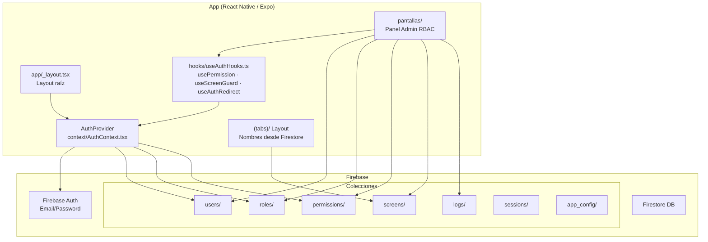
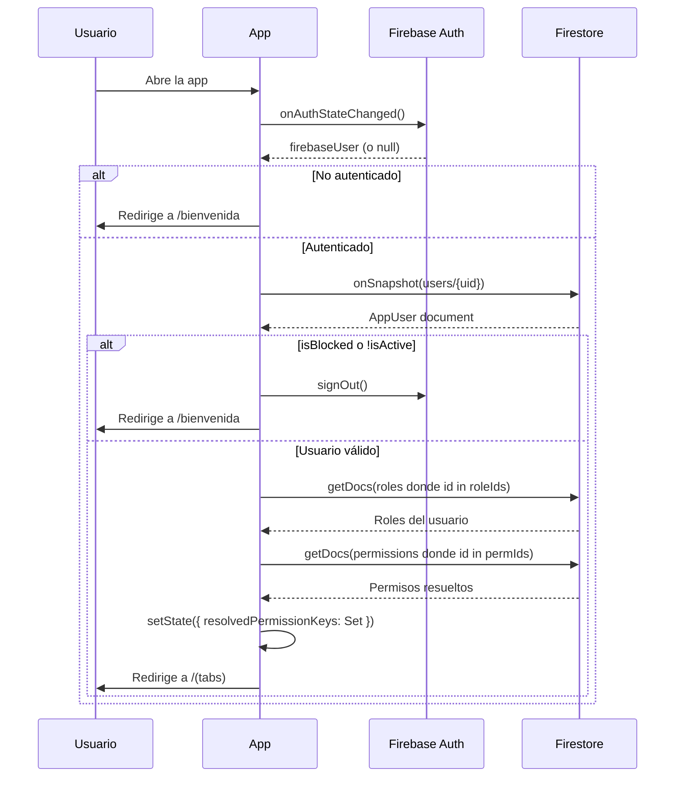
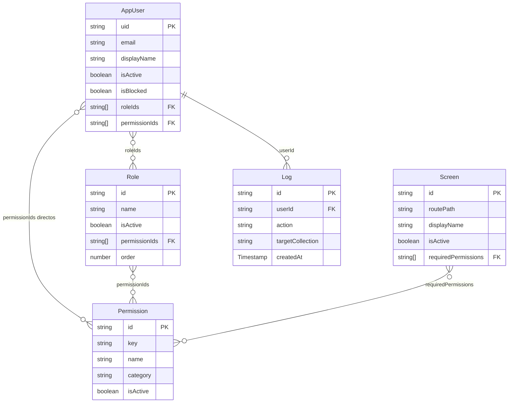

# Arquitectura del sistema

## Visión general

**Permisos App** es una aplicación Expo/React Native con autenticación y control de acceso por roles (RBAC) gestionado enteramente desde Firebase. No tiene backend propio — toda la lógica de negocio corre en el cliente con Firestore como fuente de verdad.

---

## Diagrama de arquitectura



---

## Diagrama de flujo de autenticación



---

## Diagrama del modelo de datos RBAC



---

## Estructura de navegación (Expo Router)

```
app/
├── _layout.tsx              ← Stack raíz + AuthProvider + useAuthRedirect
│
├── bienvenida/
│   └── bienvenida.tsx       ← Pantalla de bienvenida (pública)
│
├── login/
│   └── login.tsx            ← Formulario de login (pública)
│
├── (tabs)/
│   ├── _layout.tsx          ← Bottom tabs — nombres y orden desde Firestore
│   └── index.tsx            ← Tab principal (home)
│
└── pantallas/               ← Panel de administración (requiere permisos)
    ├── usuarios.tsx         ← manage:users
    ├── roles.tsx            ← manage:roles
    ├── pantallas.tsx        ← manage:screens
    ├── logs.tsx             ← read:logs
    └── system-master.tsx    ← system:master
```

---

## Decisiones técnicas

### Por qué Firestore con `onSnapshot` en vez de REST polling

Los permisos y el estado de bloqueo de usuarios cambian en tiempo real desde el panel de administración. Con `onSnapshot`, el cliente recibe los cambios inmediatamente sin necesidad de reiniciar sesión ni hacer polling. Si un admin bloquea a un usuario, ese usuario es desconectado en segundos.

### Por qué los permisos se resuelven en memoria (no se persisten en Firestore)

Persistir `resolvedPermissionKeys` en el documento del usuario crearía un problema de consistencia: si se agrega un permiso a un rol, habría que actualizar todos los usuarios con ese rol. En cambio, resolverlos en memoria al cargar la sesión garantiza que siempre estén actualizados con el estado real de roles y permisos.

### Por qué TypeScript strict mode

El proyecto usa `"strict": true` en `tsconfig.json`. Esto evita errores comunes con `null`/`undefined` en los datos de Firestore, que pueden ser `null` si los documentos no existen o tienen campos opcionales.

### Por qué `chunkArray` en lugar de una sola query

Firestore limita las consultas `where('__name__', 'in', [...])` a **10 elementos** por query. La función `chunkArray` divide los arrays de IDs en grupos de 10 y hace múltiples queries en paralelo, permitiendo usuarios con muchos roles y permisos sin errores de Firestore.

### Sobre `service-account.json`

El archivo `service-account.json` en el repo es para uso local del script `seed.js` durante el setup inicial. **Debe estar en `.gitignore`** y nunca subirse a ningún repositorio o entorno de CI/CD. En producción, usar las variables de entorno de Firebase Admin SDK o un secret manager.
